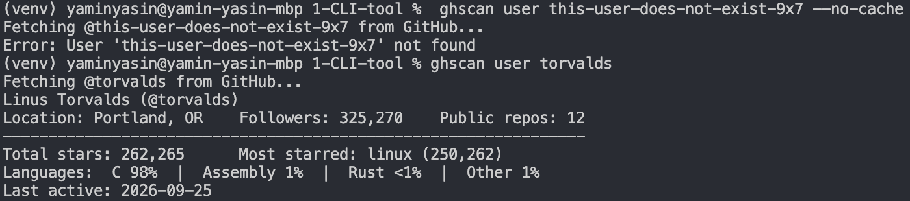

# ghscan

[](https://github.com/iamdeve/ghscan/actions/workflows/tests.yml)
[](pyproject.toml)
[](LICENSE)

A command-line tool **and REST API** for looking up any GitHub user. It shows their top repos, language breakdown, total stars and recent activity, and it can compare two users side by side or export a Markdown report.

Built with Python 3.10+, `asyncio` and `httpx`. Requests run in parallel, and results are cached for an hour, so a repeat lookup is instant.



## Install

With pip, straight from GitHub:

```bash
pip install git+https://github.com/iamdeve/ghscan
ghscan user torvalds
```

Or from a local clone, for development:

```bash
git clone https://github.com/iamdeve/ghscan.git
cd ghscan
python -m venv venv
source venv/bin/activate          # Windows: venv\Scripts\activate
pip install -e ".[dev]"
```

`python -m ghscan ...` works the same as `ghscan ...`.

## GitHub token (recommended)

Without a token, GitHub allows only 60 API requests per hour, and ghscan uses one request per repo to read its languages. To raise the limit to 5,000 per hour, create a free token:

1. Go to **GitHub → Settings → Developer settings → Personal access tokens → Fine-grained tokens**.
2. Create a token. It needs no permissions, because public data is enough.
3. Export it in your shell:

```bash
export GITHUB_TOKEN=github_pat_xxx          # macOS / Linux
$env:GITHUB_TOKEN="github_pat_xxx"          # Windows PowerShell
```

Never commit your token.

> **Without a token**, ghscan only fetches languages for the user's **20 most-starred repos**, so one lookup stays within the free limit. For users with many repos, the language percentages are then approximate.

## Usage

### `user`: profile summary

```text
$ ghscan user torvalds
Linus Torvalds (@torvalds)
Location: Portland, OR    Followers: 325,265    Public repos: 12
----------------------------------------------------------------
Total stars: 262,263      Most starred: linux (250,260)
Languages:  C 98%  |  Assembly 1%  |  Rust <1%  |  Other 1%
Last active: 2026-09-25
```

### `repos`: list repositories

`--sort` accepts `stars` (the default), `updated` or `name`. `--limit` defaults to 10.

```text
$ ghscan repos torvalds --sort stars --limit 5
@torvalds - top 5 repos by stars
#  Name           Stars   Forks  Language  Updated
-  -----------  -------  ------  --------  ----------
1  linux        250,260  65,868  C         2026-09-25
2  AudioNoise     4,503     222  C         2026-05-08
3  GuitarPedal    2,371     112  C         2026-09-24
4  uemacs         2,150     325  C         2026-08-06
5  test-tlb       1,063     222  C         2024-08-19
```

### `compare`: two users side by side

Both users are fetched in parallel.

```text
$ ghscan compare torvalds gvanrossum
              @torvalds        @gvanrossum
------------  ---------------  ----------------------
Name          Linus Torvalds   Guido van Rossum
Location      Portland, OR     San Francisco Bay Area
Followers     325,265          27,072
Public repos  12               28
Total stars   262,263          1,653
Total forks   66,878           139
Most starred  linux (250,260)  patma (1,041)
Top language  C (98%)          HTML (57%)
Joined        2011-09-03       2012-11-26
Last active   2026-09-25       2026-08-22
```

### `export`: save a report

```text
$ ghscan export torvalds --format md
Saved torvalds_report.md
```

The file contains the profile summary, the full language list and a table of every repo:

```markdown
| Repo | Stars | Forks | Language | Updated | Description |
|---|--:|--:|---|---|---|
| [linux](https://github.com/torvalds/linux) | 250,260 | 65,868 | C | 2026-09-25 | Linux kernel source tree |
| [AudioNoise](https://github.com/torvalds/AudioNoise) | 4,503 | 222 | C | 2026-05-08 | Random digital audio effects |
```

`--format json` writes the raw data instead, and `-o path` sets the output file.

### Skipping the cache

Every command accepts `--no-cache` to skip the cache and fetch fresh data:

```bash
ghscan user torvalds --no-cache
```

### Errors

Bad input or failed requests print a one-line message to stderr, never a traceback:

```text
$ ghscan user this-user-does-not-exist-9x7
Error: User 'this-user-does-not-exist-9x7' not found

$ ghscan user torvalds          # no internet
Error: Could not reach GitHub. Check your internet connection.

$ ghscan user trail-
ghscan user: error: argument username: 'trail-' is not a valid GitHub username
```

## REST API

The same analysis is also served over HTTP with FastAPI. The API reuses `github_client.py`, `report.py` and `models.py` unchanged.

**Live docs:** https://<your-service>.onrender.com/docs

> The API runs on Render's free tier, which puts it to sleep after about 15 minutes without traffic. The first request after that takes 30–60 seconds while it wakes up. Requests after that are fast.

| Method | Path | Returns |
|---|---|---|
| `GET` | `/health` | `{"status": "ok"}` |
| `GET` | `/users/{username}` | Profile plus stats: stars, forks, most starred repo, languages as `{name, percent}`, last active |
| `GET` | `/users/{username}/repos?sort=stars&limit=10&include_forks=false` | Repo list (`sort` accepts `stars`, `updated` or `name`, and `limit` is 1–100) |
| `GET` | `/compare?a=torvalds&b=gvanrossum` | Both summaries, fetched in parallel |
| `GET` | `/users/{username}/report.md` | The Markdown report as `text/markdown` |

Every endpoint that fetches data accepts `?refresh=true` to skip the cache. Responses include an `X-Cache: HIT` or `X-Cache: MISS` header.

```bash
$ curl -s localhost:8000/users/torvalds | jq '{login, total_stars, most_starred: .most_starred.name, languages}'
{
  "login": "torvalds",
  "total_stars": 262308,
  "most_starred": "linux",
  "languages": [
    {"name": "C", "percent": 97.8},
    {"name": "Assembly", "percent": 0.6},
    ...
  ]
}
```

**Status codes:** `422` for an invalid username or query, `404` for an unknown user, `429` when either this API's rate limit or GitHub's is hit (with a `Retry-After` header), and `502` for any other GitHub failure.

### Run the API locally

```bash
pip install -e ".[api]"
cp .env.example .env              # optionally add GITHUB_TOKEN
uvicorn ghscan.api.main:app --reload
```

Settings are read from the environment or from `.env` using `pydantic-settings`:

| Variable | Default | |
|---|---|---|
| `GITHUB_TOKEN` | none | Raises GitHub's limit from 60 to 5,000 requests per hour |
| `CACHE_TTL_SECONDS` | `3600` | How long a report stays cached in memory |
| `RATE_LIMIT_PER_MINUTE` | `30` | Requests allowed per client IP per minute |
| `CORS_ORIGINS` | `["*"]` | Origins allowed to call the API from a browser (GET only) |
| `TRUST_PROXY_HEADERS` | `false` | Take the client IP from `X-Forwarded-For`. Set it to `true` behind Render's proxy |

### Deploy on Render

`render.yaml` describes the service. In Render, choose **New → Blueprint** and pick this repo, or create a **Web Service** by hand:

- Build command: `pip install ".[api]"`
- Start command: `uvicorn ghscan.api.main:app --host 0.0.0.0 --port $PORT`
- Environment: add `GITHUB_TOKEN` in the dashboard (never in the code) and set `TRUST_PROXY_HEADERS=true`

### API design notes

- **One shared HTTP client.** `fetch_report(username, client)` receives its client as a parameter. The API creates one client in `lifespan` and reuses it for every request.
- **In-memory TTL cache instead of the file cache.** Render wipes the disk on every deploy and restart, so a file cache would only look persistent. Cache keys ignore case, so `Torvalds` and `torvalds` share one entry. Failed fetches are never cached.
- **Request coalescing.** If 10 requests for the same user arrive while the cache is empty, they all wait on one in-flight `asyncio.Task`, so GitHub is called only once. `asyncio.shield` stops one client disconnecting from cancelling the fetch for everyone else.
- **Per-IP rate limiter.** A sliding-window limiter written as a dependency, about 20 lines. Without it, anyone could use up the server's `GITHUB_TOKEN` quota by calling the public URL in a loop. Behind a proxy, only the right-most `X-Forwarded-For` entry is trusted, because that one is added by the proxy and can't be spoofed by the client.
- **No try/except in routes.** `UserNotFound`, `RateLimited` and `GitHubError` are turned into 404, 429 and 502 by exception handlers.
- **One username rule.** The CLI and the API share `USERNAME_PATTERN`. It avoids lookahead because Pydantic's Rust regex engine doesn't support it.

## How it works

- The profile and the repo list are fetched at the same time with `asyncio.gather`.
- The repo list is fetched page by page (100 repos per page) and stops at the first page that isn't full.
- Languages are fetched in parallel for non-fork repos. An `asyncio.Semaphore(5)` keeps at most 5 of those requests running at once.
- Forks are listed and marked `(fork)`, but they are left out of star totals and language percentages.
- Results are cached in `~/.cache/ghscan/<username>.json` for an hour. Set `GHSCAN_CACHE_DIR` to use a different folder. A corrupted cache file is treated as a cache miss.
- A 403 response counts as a rate limit only when `x-ratelimit-remaining` is `0`. In that case the message also shows when the limit resets.

## Project layout

```text
ghscan/
├── __main__.py       entry point for `python -m ghscan`
├── cli.py            argparse commands and error handling
├── github_client.py  async GitHub API calls, pagination, errors
├── cache.py          JSON cache in ~/.cache/ghscan, 1-hour expiry
├── models.py         Profile, Repo and Report Pydantic models
├── report.py         pure stats functions and text/markdown rendering
├── errors.py         GhscanError base class
└── api/
    ├── main.py       app factory, lifespan, exception handlers, CORS
    ├── routes.py     endpoints
    ├── schemas.py    response models, separate from the internal models
    ├── deps.py       settings, rate limiter, HTTP client and report loader
    └── cache.py      in-memory TTL cache with request coalescing
tests/                pytest suite, GitHub mocked with httpx.MockTransport
```

## Running tests

```bash
pip install -e ".[api,dev]"
pytest
```
